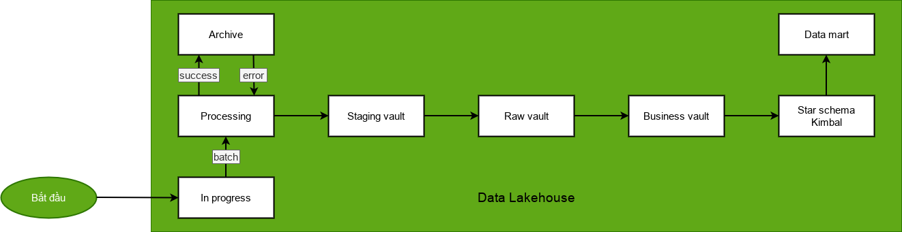
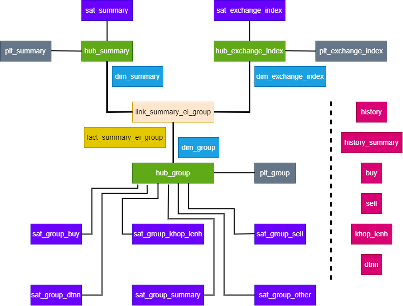

## Project introduction
<ul>
  <li>Name of project: Process stock data</li>
  <li>Project objective:
    <ul>
      <li>Building a near real-time stock data processing system</li>
      <li>Building a data lakehouse for big data</li>
    </ul>
  </li>
</ul>

## Data flow
  

## Deploy system
#### 1. Should pull and build images before
```sh
docker pull postgres tabulario/spark-iceberg tabulario/iceberg-rest minio/minio minio/mc trinodb/trino:457 starburstdata/hive:3.1.2-e.18
```
```sh
docker build ./airflow -t airflow
```
```sh
docker build ./superset -t superset
```

#### 2. Start system
```sh
docker compose up -d
```

#### 3. Set Trino in Airflow cluster
```sh
docker exec -u root -it airflow-webserver chmod +x /opt/airflow/source/trino; docker exec -u root -it airflow-scheduler chmod +x /opt/airflow/source/trino
```

#### 4. Start DAG on Airflow webserver

#### 5. Build enviroment Superset
```sh
./superset/bootstrap-superset.sh
```
  
#### 6. Visualize data in Superset with SQLalchemy uri
```
trino://hive@trino:8080/iceberg
```

## ETL
  

## Data Warehouse
  